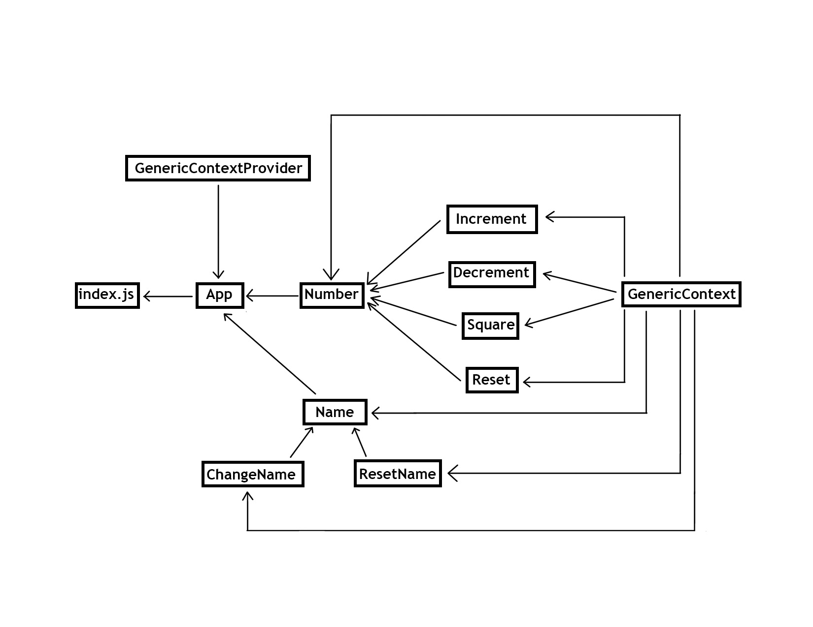
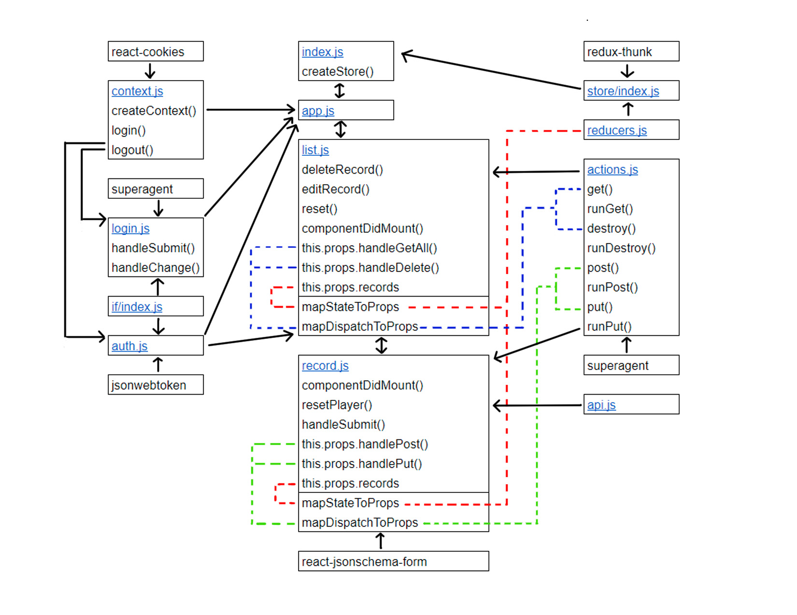

 LAB 37
=================================================

## Authorization

### Author: Katherine Smith

### Links and Resources
* [Context and Hooks](https://codesandbox.io/s/4r83y5w470)
* [Login and Auth](https://codesandbox.io/s/pyrvv2613q)

---

## Context and Hooks
### Modules
#### `context.js`
- Creates GenericContext
- Contains GenericContextProvider component
  - Contains state for number and name
  - Contains increment() method which increments the number
  - Contains decrement() method which decrements the number
  - Contains square() method which squares the number
  - Contains reset() method which resets the number
  - Contains changeName() method which changes the name
  - Contains resetName() method which resets the name
  - Renders this.props.children wrapped in GenericContext.Provider with state passed in
- Exports GenericContext and GenericContextProvider component

#### `index.js`
- Imports and renders the App component

#### `app.js`
- Imports GenericContextProvider component
- Imports Number component and Name component
- Contains App component
  - Wraps Number component and Name component in GenericContextProvider component so that they and their children can subscribe to GenericContext as consumers
  - Renders Number component and Name component
- Exports App component

#### `number.js`
- Imports GenericContext
- Imports Increment, Decrement, Square, and Reset component
- Contains Number component
  - Subscribes to GenericContext as a consumer
  - Renders the number
  - Renders Increment, Decrement, Square, and Reset component
- Exports Number component

#### `increment.js`
- Imports GenericContext
- Contains Increment component
  - Subscribes to GenericContext as a consumer
  - Renders button to increment number
- Exports Increment component

#### `decrement.js`
- Imports GenericContext
- Contains Decrement component
  - Subscribes to GenericContext as a consumer
  - Renders button to decrement number
- Exports Decrement component

#### `square.js`
- Imports GenericContext
- Contains Square component
  - Subscribes to GenericContext as a consumer
  - Renders button to square number
- Exports Square component

#### `reset.js`
- Imports GenericContext
- Contains Reset component
  - Subscribes to GenericContext as a consumer
  - Renders button to reset number
- Exports Reset component

#### `name.js`
- Imports GenericContext
- Imports ChangeName component and ResetName component
- Contains Name component
  - Subscribes to GenericContext as a consumer
  - Renders the name
  - Renders ChangeName component and ResetName component
- Exports Name component

#### `change-name.js`
- Imports GenericContext
- Contains ChangeName component
  - Subscribes to GenericContext as a consumer
  - Renders button to change name
- Exports ChangeName component

#### `reset-name.js`
- Imports GenericContext
- Contains ResetName component
  - Subscribes to GenericContext as a consumer
  - Renders button to reset name
- Exports ResetName component

#### UML

---

## Login and Auth
### Modules
#### `index.js`
- Imports App component
- Creates store and connects to store
- Contains Main component
  - Passes store down to App component
  - Renders App component

#### `app.js`
- Imports LoginContextProvider component, Login component, Auth component, and Records component
- Contains the App component
  - Wraps Login component, Auth component, and Records component in LoginContextProvider component so that they and their children can subscribe to LoginContext as consumers
  - Renders Login component, Auth component, and Records component
- Exports App component

#### `list.js`
- Imports Auth component and Record component
- Imports If() helper function
- Imports actions from the store
- Contains Records component
  - Contains own state for id
  - Contains deleteRecord() method which handles deleting a record
  - Contains editRecord() method which handles changing id
  - Contains reset() method which handles setting id to null
  - Contains componentDidMount() which handles getting the records
  - Renders the list of records and Record component while utilizing Auth component and If() helper function
- Contains mapStateToProps() which maps records state to props
- Contains mapDispatchToProps() which maps records dispatch to props
- Exports connected Records component

#### `record.js`
- Imports Form from react-jsonschema-form
- Imports get() function
- Imports actions from the store
- Contains Record component
  - Contains own state for schema
  - Contains componentDidMount() which handles getting the schema
  - Contains resetPlayer() method which handles setting id to null
  - Contains handleSubmit() method which handles submitting the form
  - Renders the form
- Contains mapStateToProps() which maps records state to props
- Contains mapDispatchToProps() which maps records dispatch to props
- Exports connected Record component

### Store Modules
#### `store/index.js`
- Imports reducers and redux-thunk
- Exports function to create the store

#### `actions.js`
- Imports superagent
- Contains get(), destroy(), post(), and put() as actions to be dispatched
- Contains runGet(), runDestroy(), runPost() and runPut() as helper functions

#### `reducers.js`
- Maintains state for the store

### Auth Modules
#### `context.js`
- Creates LoginContext
- Contains LoginContextProvider component
  - Contains state for token and loggedIn
  - Contains login() method which handles logging in
  - Contains logout() method which handles logging out
  - Renders this.props.children wrapped in LoginContext.Provider with state passed in
- Exports LoginContext and LoginContextProvider component

#### `login.js`
- Imports LoginContext
- Imports superagent and If() helper function
- Contains Login component
  - Contains own state for username and password
  - Contains handleSubmit() method which handles submitting username and password
  - Contains handleChange() method which handles changes to input fields
  - Subscribes to LoginContext as a consumer
  - Renders login form and log out button while utilizing If() helper function
- Exports Login component

#### `auth.js`
- Imports LoginContext
- Imports jsonwebtoken and If() helper function
- Contains Auth component
  - Subscribes to LoginContext as a consumer
  - Utilizes jsonwebtoken and If() helper function to verify if it is ok to render this.props.children
- Exports Auth component

### Library Modules
#### `api.js`
- Contains and exports get() function for superagent get requests
#### `if/index.js`
- Contains and exports If() helper function 

#### UML
